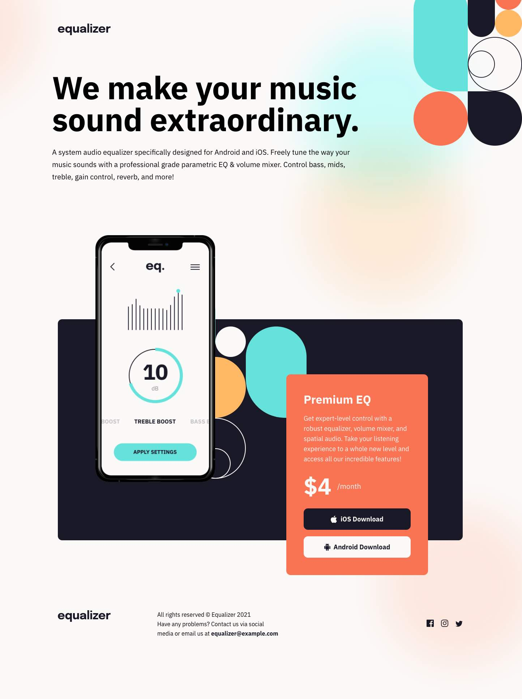
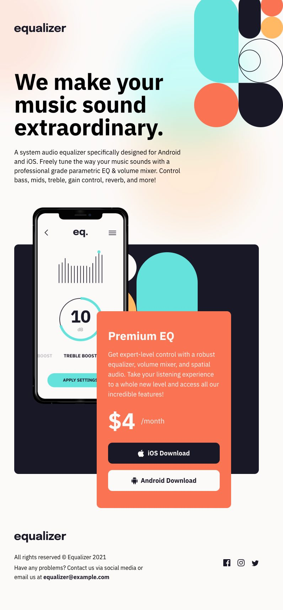
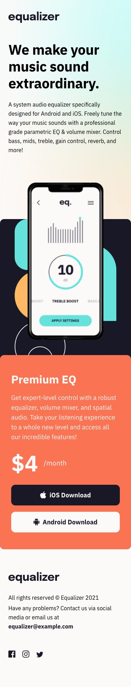

# Frontend Mentor - Equalizer landing page solution

This is Max Ruuen's solution to the [Equalizer landing page challenge on Frontend Mentor](https://www.frontendmentor.io/challenges/equalizer-landing-page-7VJ4gp3DE). Frontend Mentor challenges help you improve your coding skills by building realistic projects.

## Table of contents

- [Overview](#overview)
  - [The challenge](#the-challenge)
  - [Screenshot](#screenshot)
  - [Links](#links)
- [My process](#my-process)
  - [Built with](#built-with)
  - [What I learned](#what-i-learned)
  - [Useful resources](#useful-resources)
- [Author](#author)

## Overview

### The challenge

Users should be able to:

- View the optimal layout depending on their device's screen size
- See hover states for interactive elements

### Screenshot

#### Desktop Solution

#### Tablet Solution

#### Mobile Solution

### Links

- Solution URL: [Frontend Mentor](https://www.frontendmentor.io/solutions/equalizer-landing-page-using-scss-and-bem-SJI75p5Vc)
- Live Site URL: [Cloudflare Pages](https://mbr-challenge-equalizer-landing-page.pages.dev/)

## My process

### Built with

- HTML / CSS
- Flexbox
- Mobile-first workflow
- Google Fonts
- SVG

### What I learned

This was a fun project to attempt after taking a break from front-end challenges to work on back-end learning. The most difficult aspect was always the background image placement, and this continues to cause pain after a few projects of practice. I need to practice more CSS background positioning in isolation.

I feel this was one of my more responsive designs so far.

### Useful resources

- [CSS filter generator to convert black SVG to specific hex colour](https://codepen.io/sosuke/pen/Pjoqqp) - This allowed me to easily re-colour the footer social icons on hover.

## Author

- Frontend Mentor - [@ruuen](https://www.frontendmentor.io/profile/ruuen)
- Twitter - [@maxruuen](https://www.twitter.com/maxruuen)
